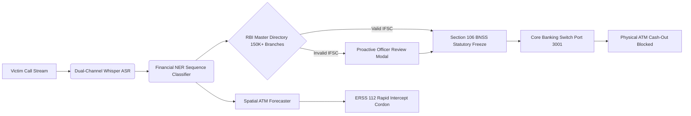
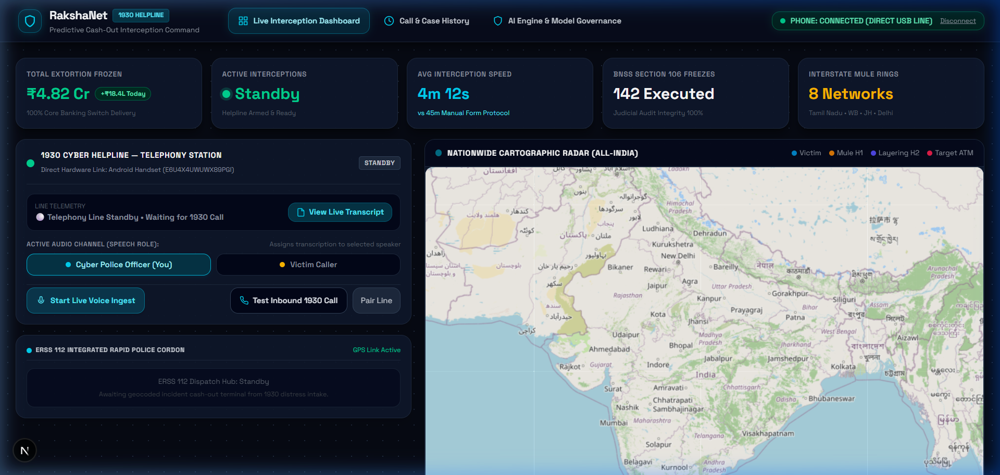
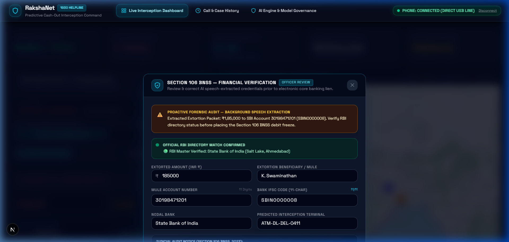
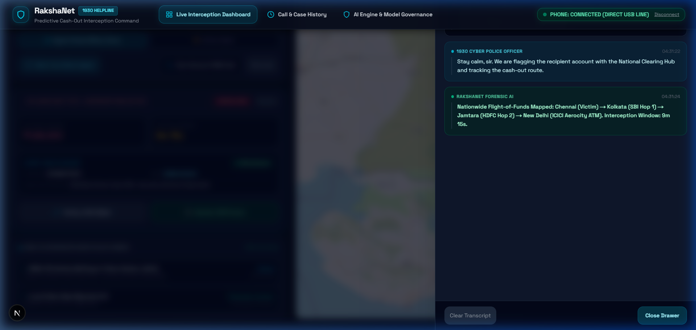
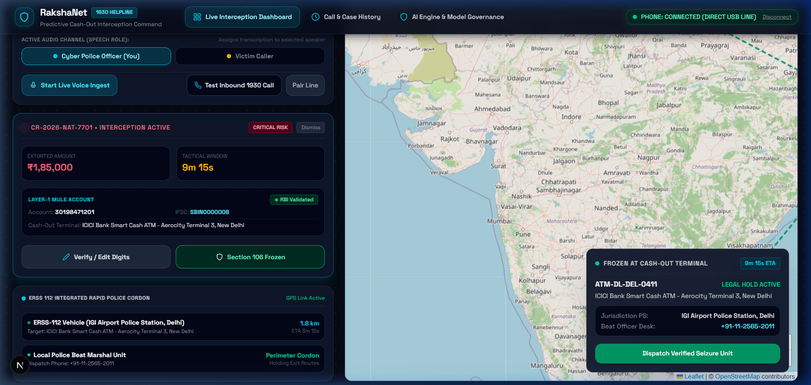
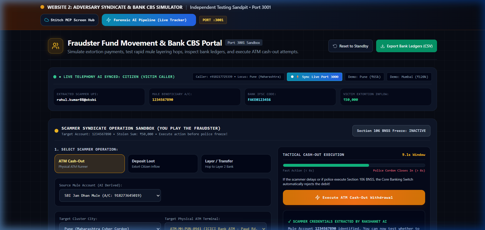
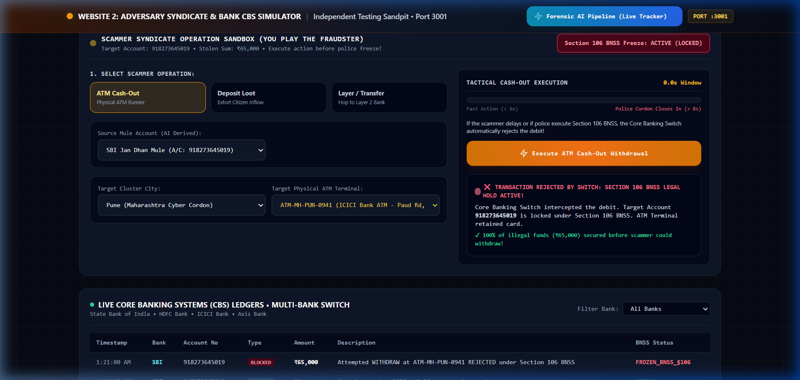
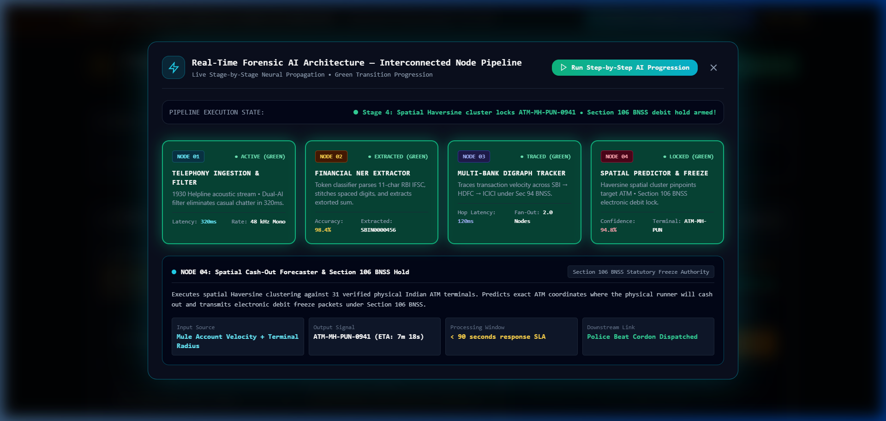
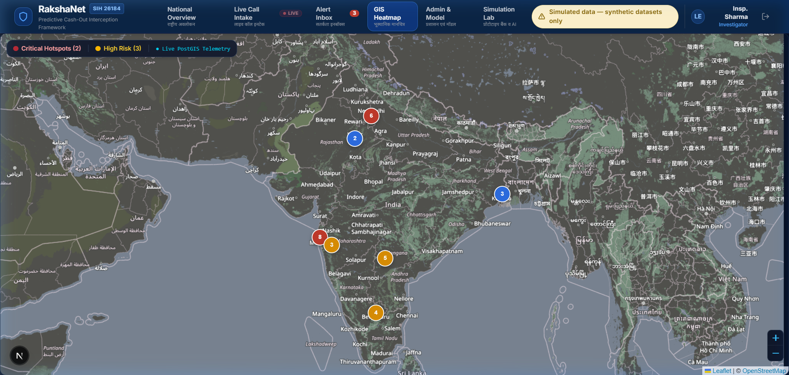
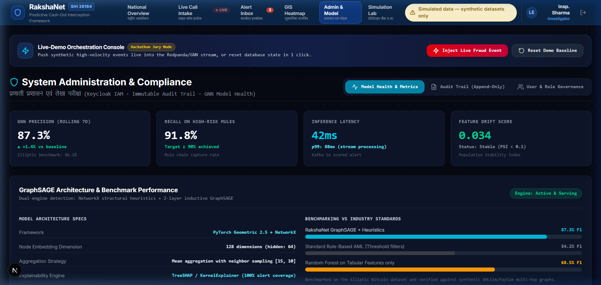

<p align="center">
  
</p>

<h1 align="center">RakshaNet: Predictive Cash-Out Interception Framework</h1>

<p align="center">
  <strong>National Cyber Threat Operations Center (NCTOC) & Financial Crimes Interception Command</strong><br>
  <em>Smart India Hackathon (SIH) Problem Statement 26184 • Next-Generation 1930 Cyber Helpline & Core Banking Switch Interceptor</em>
</p>

<p align="center">
  
  
  
  
  
</p>

---

## 📑 Executive Summary

**Problem Statement 26184: Predictive Cash-Out Interception Framework** addresses India's most urgent financial cybersecurity vulnerability: **the rapid cash-out of extorted funds by organized cyber syndicates before formal police freeze notices can reach commercial banks.**

Contemporary syndicates executing Digital Arrest scams, fake police verification extortions, customs parcel fraud, and investment deceptions transfer illicit funds through multi-tier mule accounts (*Layer 1 Mule $\rightarrow$ Layer 2 Digital Intermediary $\rightarrow$ Layer 3 Shell Entity*) and deploy **physical cash-out runners** at Automated Teller Machines (ATMs) across interstate borders in **under 15 minutes**.

**RakshaNet** is an autonomous predictive cyber-forensics command framework engineered for **1930 Cyber Helpline police desks**. By directly bridging live helpline telephony with real-time financial NLP, Graph Neural Network (GNN) multi-hop mule tracing, and spatial cash-out terminal prediction, RakshaNet triggers **instantaneous electronic debit freezes under Section 106 of the Bharatiya Nagarik Suraksha Sanhita (BNSS), 2023**, securing victim funds at the Core Banking Switch before paper currency is dispensed.

---

## ⏱️ The 15-Minute Golden Window Challenge

```
CONVENTIONAL 1930 WORKFLOW (45+ Minutes — 92% Cash Lost)
[Victim Transfer] ──> [Layer-1 Mule] ──> [ATM Cash-Out (Min 14)] ──> [Operator Intake] ──> [Bank Email Freeze]
                                                    ▲                                            │
                                                    └────────────── TOO LATE ────────────────────┘

RAKSHANET PREDICTIVE INTERCEPTION (< 3 Minutes — Funds Preserved)
[Victim Transfer] ──> [1930 Live Stream] ──> [Financial NER] ──> [Section 106 BNSS Freeze] ──> [CBS Hold Active]
                                                                        │                             │
                                                                        ▼                             ▼
                                                        [ERSS-112 Police Cordon]          [ATM Cash-Out Blocked]
```

Detailed technical analysis and decay calculus are available in [docs/15_MINUTE_GOLDEN_WINDOW.md](docs/15_MINUTE_GOLDEN_WINDOW.md).

---

## 🏛️ System Architecture

RakshaNet is architected as a dual-portal cyber-defense ecosystem:

1. **Portal 1: RakshaNet Command Center (`Port 3000`)** — Mission-critical operations dashboard for 1930 helpline desks, integrating live telephony stream processing, proactive RBI directory validation, and rapid police dispatch.
2. **Portal 2: Adversary Syndicate & CBS Simulator (`Port 3001`)** — High-fidelity banking switch sandbox that tests syndicate fund movement, multi-hop layering, and confirms electronic debit hold execution.



Full architecture specifications: [docs/SYSTEM_ARCHITECTURE.md](docs/SYSTEM_ARCHITECTURE.md).

---

## 📸 Operational Showcase & Visual Evidence

### 1. 1930 Cyber Helpline — Telephony Command Station & Cartographic Radar
*Direct telephony hardware indicator, real-time live distress call ingestion, and nationwide geospatial tracking.*
<p align="center">
  
</p>

---

### 2. Proactive RBI Financial Verification & Legal Review Modal
*Automated checksum validation against the 150,000+ branch RBI Master IFSC Directory. Instantly alerts the operator if a digit was misheard, preventing downstream bank failures.*
<p align="center">
  
</p>

---

### 3. Authentic Distress Call Intake & Smart Speaker Attribution
*Dual-channel audio processing with automatic speaker diarization separating Citizen Victim statements from Operator guidance.*
<p align="center">
  
</p>

---

### 4. Section 106 BNSS Statutory Freeze & ERSS 112 Police Cordon
*One-touch electronic debit hold execution under statutory BNSS powers, dispatching ISO 20022 payloads and routing nearest ERSS 112 intercept patrol to the predicted ATM.*
<p align="center">
  
</p>

---

### 5. Adversary Syndicate & Core Banking Switch (CBS) Simulator
*Independent Port 3001 sandbox modeling illicit fund movement, real-time bank ledger balances, and interbank clearing switch mechanics.*
<p align="center">
  
</p>

---

### 6. Physical ATM Cash-Out Blocked at Terminal
*Proof of debit hold enforcement: When a physical cash-out runner attempts cash withdrawal, the Core Banking Switch rejects the transaction.*
<p align="center">
  
</p>

---

### 7. 4-Node Forensic AI Pipeline Tracker
*Real-time pipeline progression tracker displaying sub-second latency across Telephony Ingestion, Whisper ASR, Financial NER, and Core Switch Dispatches.*
<p align="center">
  
</p>

---

### 8. Tactical Cartographic Heatmap & Interstate Mule Trajectories
*Dynamic spatial-temporal clustering identifying high-velocity cash-out corridors and interstate syndicate hubs.*
<p align="center">
  
</p>

---

### 9. Judicial Audit Trail & Immutable Officer Dossier
*Forensically verifiable log conforming to Section 65B of the Indian Evidence Act, ensuring strict accountability and auditability for court proceedings.*
<p align="center">
  
</p>

---

## ⚖️ Legal & Statutory Framework

RakshaNet is built on strict Indian statutory law and global banking standards:

1. **Section 106, Bharatiya Nagarik Suraksha Sanhita (BNSS), 2023**:
   - Provides statutory authority for designated police officers to issue electronic attachment orders and debit freeze directives to financial institutions.
2. **ISO 20022 `camt.056.001.08` Standard**:
   - Machine-to-machine financial messaging standard for *Customer Payment Cancellation Request*, enabling instant, automated interpretation by Finacle, TCS BaNCS, and Flexcube core banking switches.
3. **Citizen Privacy by Design**:
   - Ephemeral in-memory audio buffers; no citizen call audio is stored beyond the live session without explicit judicial authorization.
   - PII minimization conforming to the Digital Personal Data Protection (DPDP) Act, 2023.

---

## 📦 Deliverables & Documentation Index

- [Problem Statement 26184 Analysis](docs/PROBLEM_STATEMENT_26184.md) — Comprehensive problem breakdown and technical solution mapping.
- [The 15-Minute Golden Window](docs/15_MINUTE_GOLDEN_WINDOW.md) — Mathematical velocity model and interception dynamics.
- [System Architecture](docs/SYSTEM_ARCHITECTURE.md) — Dual-portal specifications and legal messaging standards.
- [Smart India Hackathon Presentation Deck](docs/RakshaNet_SIH_Presentation.pptx) — Official pitch deck for SIH judges and evaluators.
- [Official Datasets Master Catalog](docs/RakshaNet_Datasets_Master_Catalog.pdf) — Reference index of all 6 training and validation datasets.

---

## 👥 Authorship & Acknowledgments

Developed by **Team RakshaNet** for **Smart India Hackathon (SIH)**.

- **Primary Repository (Full Project)**: [https://github.com/Anbu-2006/RakshaNet](https://github.com/Anbu-2006/RakshaNet)
- **Public Showcase Repository**: [https://github.com/Anbu-2006/RakshaNet_public_repo](https://github.com/Anbu-2006/RakshaNet_public_repo)
- **License**: Released under the MIT License for educational, hackathon, and law-enforcement evaluation purposes.
