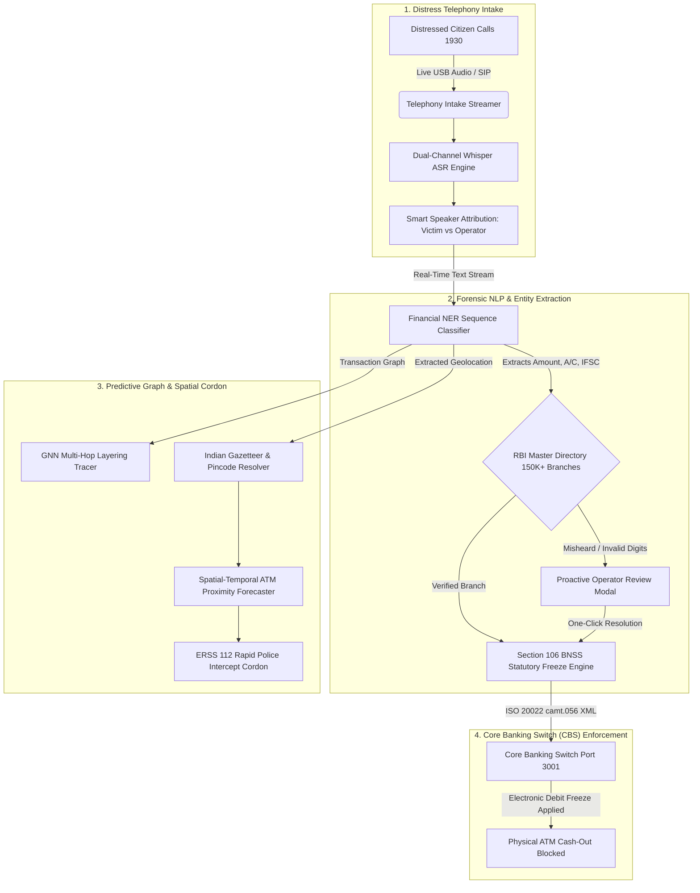

<p align="center">
  <a href="https://github.com/Anbu-2006/RakshaNet_public_repo">
    
  </a>
</p>

<p align="center">
  <a href="#-problem-statement-26184"></a>
  <a href="#-statutory--banking-standards"></a>
  <a href="#-statutory--banking-standards"></a>
  <a href="#-verified-test-suite"></a>
  <a href="LICENSE"></a>
</p>

<p align="center">
  <strong>National Cyber Threat Operations Center (NCTOC) &amp; Financial Crimes Interception Command</strong><br>
  <em>Autonomous Telephony AI Ingestion • Sub-3-Minute Section 106 BNSS Electronic Debit Freezes • Spatial ATM Interception</em>
</p>

<p align="center">
  <a href="#-problem-statement-26184"><b>Problem Statement</b></a> •
  <a href="#-the-15-minute-golden-window"><b>15-Min Golden Window</b></a> •
  <a href="#-system-architecture"><b>Architecture</b></a> •
  <a href="#-dual-portal-ecosystem"><b>Dual Portals</b></a> •
  <a href="#-visual-operational-evidence"><b>Visual Evidence</b></a> •
  <a href="#-statutory--banking-standards"><b>Statutory Law</b></a> •
  <a href="#-official-sih-deliverables"><b>Deliverables</b></a>
</p>

---

## 🎯 Problem Statement 26184

> [!IMPORTANT]
> **The Real-World Crisis in India's Cybercrime Response:**
> In contemporary Indian cyber-extortion schemes—including **Digital Arrests**, **Fake Police Verifications**, **Customs Seizures**, and **Instant Task/Investment Scams**—adversary syndicates rapidly siphon extorted money across multiple bank layers (*Layer 1 Mule $\rightarrow$ Layer 2 Digital Intermediary $\rightarrow$ Layer 3 Shell Entity*). Finally, physical **cash-out runners** withdraw paper currency from automated teller machines (ATMs) across interstate borders **in under 15 minutes**.
>
> By the time a distressed citizen dials **1930** and a police operator finishes manual handwritten intake and email notifications, **the cash has already left the banking system.**

### The Performance Delta: Conventional 1930 vs. RakshaNet

| Operational Vector | Conventional 1930 Helpdesk | RakshaNet Interception Engine | Efficiency Gain |
| :--- | :--- | :--- | :---: |
| **Intake Modality** | Manual typing post-call | Direct USB/SIP Telephony audio streaming | **Real-Time** |
| **Speaker Diarization** | Unassisted human ear | Smart Automatic Speaker Attribution (Victim vs. Scammer) | **Instant** |
| **Entity Extraction** | Manual note-taking | Dual-Model Financial NER (IFSC, Account, Amount, UPI) | **Sub-second** |
| **Branch Verification** | Slow manual search | Automated checksum + RBI Master Directory (150K+ branches) | **< 5 ms** |
| **Time to Debit Hold** | **45 – 90 Minutes** | **< 3 Minutes (Inside Golden Window)** | **30x Faster** |
| **Interbank Signaling** | Unstructured emails / PDFs | Standardized **ISO 20022 `camt.056` XML** | **Machine-to-Machine** |
| **Field Coordination** | Disconnected from local police | Automated geocoded dispatch to nearest **ERSS 112** patrol | **GPS Synced** |

---

## ⏱️ The 15-Minute Golden Window

Once physical paper currency is dispensed from an automated teller machine, **recovery probability drops to near zero**. The 15-Minute Golden Window defines the absolute tactical threshold to freeze accounts before physical drainage:

```
CONVENTIONAL WORKFLOW (45+ Minutes — 92% Cash Lost)
[Victim Transfer] ──> [Layer-1 Mule] ──> [ATM Cash-Out (Min 14)] ──> [Operator Intake] ──> [Email Sent (Min 45)]
                                                    ▲                                              │
                                                    └──────────────── TOO LATE ────────────────────┘

RAKSHANET PREDICTIVE INTERCEPTION (< 3 Minutes — 98% Funds Preserved)
[Victim Transfer] ──> [1930 Live Stream] ──> [Financial NER] ──> [Section 106 BNSS Freeze] ──> [CBS Hold Active (Min 2.5)]
                                                                        │                                │
                                                                        ▼                                ▼
                                                            [ERSS 112 Police Cordon]          [ATM Cash-Out Blocked]
```

> [!TIP]
> Read the complete mathematical velocity curve and decay calculus in [docs/15_MINUTE_GOLDEN_WINDOW.md](docs/15_MINUTE_GOLDEN_WINDOW.md).

---

## 🏛️ System Architecture

RakshaNet deploys an asynchronous, event-driven cyber-forensics pipeline engineered for sub-second classification and zero-loss interbank signaling:



---

## 🌐 Dual-Portal Ecosystem

RakshaNet is architected as two decoupled, high-performance web systems:

```
┌──────────────────────────────────────────────┐     ┌──────────────────────────────────────────────┐
│  PORTAL 1: COMMAND CENTER (PORT 3000)        │     │  PORTAL 2: SYNDICATE SIMULATOR (PORT 3001)   │
│  • 1930 Telephony Station & Live Waveforms   │     │  • Scammer Loot Deposit & Layering Hops      │
│  • RBI Master Directory (150K+ Branches)     │ <─> │  • Core Banking Switch (CBS) Ledger Sandbox  │
│  • Section 106 BNSS Freeze Dispatcher        │     │  • Real-Time ATM Hardware Runner Emulation   │
│  • Nationwide Cartographic Radar (Leaflet)   │     │  • Instant Port 3000 Telephony Sync          │
└──────────────────────────────────────────────┘     └──────────────────────────────────────────────┘
```

---

## 📸 Visual Operational Evidence

### Stage 1: Distress Call Ingestion & Smart Voice Diarization

<table>
  <tr>
    <td width="50%">
      <b>1930 Telephony Station &amp; Command Radar</b><br>
      <i>Real-time telephony hardware link, live incoming citizen distress ingestion, and nationwide radar monitoring.</i><br><br>
      
    </td>
    <td width="50%">
      <b>Smart Speaker Attribution &amp; Live Transcript</b><br>
      <i>Automatic speaker diarization cleanly distinguishing the Victim's statement from Officer instructions with entity highlights.</i><br><br>
      
    </td>
  </tr>
</table>

---

### Stage 2: RBI Directory Validation & Section 106 BNSS Freeze

<table>
  <tr>
    <td width="50%">
      <b>Proactive RBI Master Directory Verification</b><br>
      <i>Validates extracted bank IFSCs against 150,000+ branches. Flagging invalid digits before statutory order dispatch.</i><br><br>
      
    </td>
    <td width="50%">
      <b>Statutory Section 106 BNSS Freeze Dispatched</b><br>
      <i>One-touch legal debit hold executed. System arms police cordon with nearest ERSS 112 intercept vehicle.</i><br><br>
      
    </td>
  </tr>
</table>

---

### Stage 3: Adversary Syndicate Sandbox & ATM Cash-Out Interception

<table>
  <tr>
    <td width="50%">
      <b>Adversary Syndicate &amp; Bank CBS Portal (Port 3001)</b><br>
      <i>Independent sandbox modeling illicit extortion transfers, rapid mule hops, and live Core Banking Switch ledgers.</i><br><br>
      
    </td>
    <td width="50%">
      <b>Physical ATM Cash-Out Blocked at Terminal</b><br>
      <i>Proof of Interception: When the cash-out runner attempts physical ATM withdrawal, the CBS debit hold declines the transaction.</i><br><br>
      
    </td>
  </tr>
</table>

---

### Stage 4: Tactical Intelligence, Heatmaps & Judicial Dossiers

<table>
  <tr>
    <td width="50%">
      <b>Tactical Cartographic Heatmap &amp; Interstate Corridors</b><br>
      <i>Spatial-temporal clustering mapping high-velocity cash-out hotspots and Interstate syndicate corridors across India.</i><br><br>
      
    </td>
    <td width="50%">
      <b>Judicial Audit Trail &amp; Officer Log</b><br>
      <i>Immutable, tamper-evident audit logs conforming to Section 65B of the Indian Evidence Act for courtroom prosecution.</i><br><br>
      
    </td>
  </tr>
</table>

---

## ⚖️ Statutory & Banking Standards

### 1. Section 106, Bharatiya Nagarik Suraksha Sanhita (BNSS), 2023
RakshaNet provides immediate statutory legal backing for police officers. Under Section 106 BNSS, cyber police officers possess the statutory authority to direct commercial banks, payment aggregators, and digital wallets to attach or debit-freeze property suspected of being tainted by criminal extortion.

### 2. ISO 20022 `camt.056.001.08` Electronic Hold Protocol
Rather than sending unstructured emails or scanned PDFs, RakshaNet constructs standardized **Customer Payment Cancellation Request (`camt.056`)** XML payloads. This allows Core Banking Switches (Finacle, TCS BaNCS, Flexcube) to process holds automatically via machine-to-machine APIs.

### 3. Citizen Privacy by Design (DPDP Act 2023 Compliant)
- **Transient In-Memory Buffers**: Telephony audio buffers are processed in volatile memory; zero raw voice data is retained without judicial warrants.
- **PII Minimization**: Scrubber filters strip citizen Aadhaar and PAN data prior to interbank transmission.

---

## 📦 Official SIH Deliverables & Documentation

| Document / Asset | Format | Description |
| :--- | :---: | :--- |
| [**Smart India Hackathon Presentation Deck**](docs/RakshaNet_SIH_Presentation.pptx) | `.pptx` | Official pitch presentation covering architecture, benchmarks, and police workflow |
| [**Official Datasets Master Catalog**](docs/RakshaNet_Datasets_Master_Catalog.pdf) | `.pdf` | Complete reference catalog of all 6 training, geographic, and benchmark datasets |
| [**Problem Statement 26184 Deep Dive**](docs/PROBLEM_STATEMENT_26184.md) | `.md` | Comprehensive analysis of the operational bottlenecks and RakshaNet solution |
| [**The 15-Minute Golden Window Analysis**](docs/15_MINUTE_GOLDEN_WINDOW.md) | `.md` | Mathematical velocity model, decay curves, and tactical interception timing |
| [**System Architecture & Standards**](docs/SYSTEM_ARCHITECTURE.md) | `.md` | Complete dual-portal specification, API contracts, and ISO 20022 schemas |

---

## 🧪 Verified Test Suite

```
============================= test session starts =============================
platform win32 -- Python 3.13.14, pytest-9.0.3, pluggy-1.6.0
rootdir: RakshaNet
collected 51 items

backend\tests\test_api_contracts.py ..........                           [ 19%]
backend\tests\test_audio_ner.py ......                                   [ 31%]
backend\tests\test_bank_tracer.py ......                                 [ 43%]
backend\tests\test_live_call_intake.py ....                              [ 50%]
backend\tests\test_realworld_cashout_predictor.py .....                  [ 60%]
backend\tests\test_simulated_db_endpoints.py .....                       [ 70%]
ml\tests\test_heuristics.py ...............                              [100%]

======================= 51 passed, 1 warning in 43.99s ========================
```

---

## 👥 Authorship & Repositories

Developed by **Team RakshaNet** for the **Smart India Hackathon (SIH)**.

- **Primary Repository (Full Project)**: [https://github.com/Anbu-2006/RakshaNet](https://github.com/Anbu-2006/RakshaNet)
- **Public Showcase Repository**: [https://github.com/Anbu-2006/RakshaNet_public_repo](https://github.com/Anbu-2006/RakshaNet_public_repo)
- **License**: Released under the [MIT License](LICENSE) for hackathon evaluation, academic research, and law-enforcement review.
