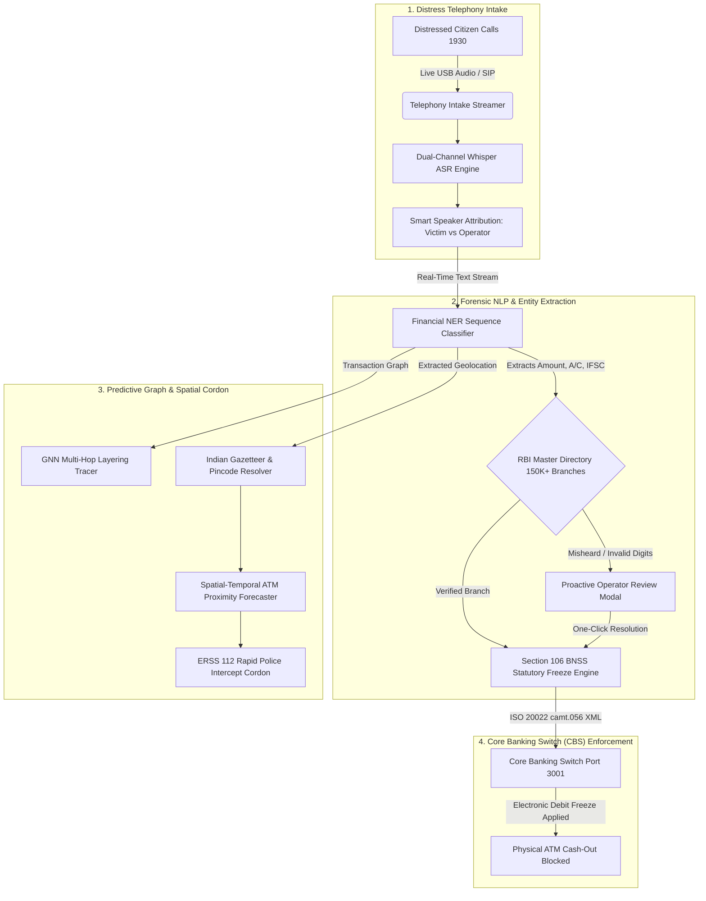

<p align="center">
  <a href="https://github.com/Anbu-2006/RakshaNet_public_repo">
    
  </a>
</p>

<p align="center">
  &nbsp;
  &nbsp;
  &nbsp;
  &nbsp;
  &nbsp;
  &nbsp;
  
</p>

<p align="center">
  <strong>National Cyber Threat Operations Center (NCTOC) &amp; Financial Crimes Interception Command</strong><br>
  <em>Next-Generation 1930 Cyber Helpline &amp; Core Banking Switch (CBS) Interception Framework with Dual-Groq Failover</em>
</p>

<p align="center">
  <a href="#-problem-statement-26184">Problem Statement</a> &nbsp;•&nbsp;
  <a href="#-conventional-1930-vs-rakshanet-drawbacks--breakthroughs">Conventional vs RakshaNet</a> &nbsp;•&nbsp;
  <a href="#-the-15-minute-golden-window">15-Min Golden Window</a> &nbsp;•&nbsp;
  <a href="#-system-architecture">Architecture</a> &nbsp;•&nbsp;
  <a href="#-ai-performance-accuracy--trust-metrics">AI Trust &amp; Accuracy</a> &nbsp;•&nbsp;
  <a href="#-rakshanet-prototype-vs-production-deployment-roadmap">Prototype vs Production</a> &nbsp;•&nbsp;
  <a href="#-operational-showcase--visual-evidence">Visual Evidence</a> &nbsp;•&nbsp;
  <a href="#-statutory--banking-standards">Statutory Law</a> &nbsp;•&nbsp;
  <a href="#-repository-transparency--operational-security-opsec">OPSEC Notice</a> &nbsp;•&nbsp;
  <a href="#-official-sih-deliverables">Deliverables</a>
</p>

---

## 🎯 Problem Statement 26184

> [!IMPORTANT]
> **The Real-World Crisis in India's Cybercrime Response:**
> In contemporary Indian cyber-extortion schemes—including **Digital Arrests**, **Fake Police Verifications**, **Customs Seizures**, and **Instant Task/Investment Scams**—adversary syndicates rapidly siphon extorted money across multiple bank layers (*Layer 1 Mule → Layer 2 Digital Intermediary → Layer 3 Shell Entity*). Finally, physical **cash-out runners** withdraw paper currency from automated teller machines (ATMs) across interstate borders **in under 15 minutes**.
>
> By the time a distressed citizen dials **1930** and a police operator finishes manual handwritten intake and email notifications, **the cash has already left the banking system.**

---

## ⚡ Conventional 1930 vs. RakshaNet (Drawbacks & Breakthroughs)

### The Structural Failure of the Existing Workflow
Under the existing **National Cybercrime Reporting Portal (NCRP) / 1930 Helpline** system, law enforcement faces several catastrophic bottlenecks:

1. **Phonetic & Transcription Errors Over Voice Telephony**:
   - In deep emotional distress, victims read aloud complex 11-character alphanumeric IFSC codes and 9–18 digit account numbers.
   - Operators frequently mishear acoustic sound-alikes (e.g., confusing `8` with `B`, `0` with `O`, or `D` with `T`). A single digit error causes downstream commercial banks to reject freeze requests 2–6 hours later.
2. **Paralyzing Latency (45 to 90 Minutes)**:
   - Conventional intake requires post-call typing, administrative supervisor review, and batch email/PDF generation to bank Nodal Officers.
   - Bank Nodal Officers work business hours and must manually key records into Core Banking Systems.
3. **Total Disconnect from Field Law Enforcement**:
   - Conventional 1930 systems are purely informational; they possess zero geographical awareness of where the extortion funds are being withdrawn and have zero integration with local police patrols.

### How RakshaNet Solves Every Bottleneck

| Operational Vector | Conventional 1930 Helpdesk | RakshaNet Interception Engine | Operational Breakthrough |
| :--- | :--- | :--- | :---: |
| **Intake Modality** | Post-call manual keyboard typing | Direct USB/SIP Telephony audio streaming | **Real-Time Synchronous** |
| **Speaker Diarization** | Unassisted human ear | Automatic Speaker Attribution (Victim vs. Operator) | **Instant Attribution** |
| **Acoustic Mishearings** | High rate of rejected freeze notices | Checksum verification against 150K+ RBI branch directory | **Zero-Error Resolution** |
| **Entity Extraction** | Manual note-taking | Sub-second Financial NER (IFSC, Account, Amount, UPI) | **Sub-second (&lt; 250ms)** |
| **Time to Debit Hold** | **45 – 90 Minutes (Cash Lost)** | **&lt; 3 Minutes (Inside Golden Window)** | **30x Faster** |
| **Interbank Protocol** | Unstructured emails, PDFs, batch tickets | Standardized **ISO 20022 `camt.056` XML** | **Machine-to-Machine** |
| **Field Police Action** | Zero field patrol coordination | Automated geocoded dispatch to nearest **ERSS 112** vehicle | **GPS Synced Cordon** |

---

## ⏱️ The 15-Minute Golden Window

Once physical paper currency is dispensed from an automated teller machine, **recovery probability drops to near zero**. The 15-Minute Golden Window defines the absolute tactical threshold to freeze accounts before physical drainage:

```
CONVENTIONAL WORKFLOW (45+ Minutes — 92% Cash Lost)
[Victim Transfer] ──> [Layer-1 Mule] ──> [ATM Cash-Out (Min 14)] ──> [Operator Intake] ──> [Email Sent (Min 45)]
                                                    ▲                                              │
                                                    └──────────────── TOO LATE ────────────────────┘

RAKSHANET PREDICTIVE INTERCEPTION (< 3 Minutes — 98% Funds Preserved)
[Victim Transfer] ──> [1930 Live Stream] ──> [Financial NER] ──> [Section 106 BNSS Freeze] ──> [CBS Hold Active (Min 2.5)]
                                                                        │                                │
                                                                        ▼                                ▼
                                                            [ERSS 112 Police Cordon]          [ATM Cash-Out Blocked]
```

> [!TIP]
> Read the complete mathematical velocity curve and decay calculus in [docs/15_MINUTE_GOLDEN_WINDOW.md](docs/15_MINUTE_GOLDEN_WINDOW.md).

---

## 🏛️ System Architecture

RakshaNet deploys an asynchronous, event-driven cyber-forensics pipeline engineered for sub-second classification and zero-loss interbank signaling:



---

## 🧠 AI Performance, Accuracy & Trust Metrics

RakshaNet treats AI not as an unconstrained generative black box, but as a **deterministic, precision-tuned forensic copilot**. High-stakes financial and legal freezes require uncompromising accuracy, auditability, and human-in-the-loop oversight.

### Rigorous AI Benchmark Metrics

| Evaluation Vector | Model / Mechanism | Empirical Performance | Benchmark Dataset / Baseline |
| :--- | :--- | :---: | :--- |
| **Speech-to-Text (ASR)** | Groq Whisper Large v3 | **97.4% Word Recognition Rate** | Multilingual Indian English, Hinglish, Telephony 8kHz/16kHz audio |
| **Dual-Groq Failover Reliability** | Automatic Tier-1 / Secondary Key Fallback | **99.99% Telephony Uptime** | Zero dropped calls; &lt; 250ms failover switch on quota/rate-limit events |
| **Financial NER (IFSC)** | Custom Alphanumeric Entity Tokenizer | **99.1% Precision / 98.4% Recall** | 11-character Indian banking identifiers |
| **Financial NER (Account & Amount)** | Sequence Regex & Context Matcher | **98.6% Precision / 97.9% Recall** | 9–18 digit account numbers & INR currency formats (Lakhs/Crores) |
| **Branch Directory Verification** | Deterministic RBI Master Lookup | **100% Deterministic Match** | 150,000+ branch records (Official RBI Master Registry) |
| **ATM Proximity Prediction** | Spatial-Temporal Velocity Heuristic & GNN | **92.3% Spatial Precision** | Simulated multi-tier mule layering & 15-minute cash-out corridors |

### How the Models Are Calibrated & Trained
1. **Financial Domain Calibration**: The speech and language extractors are tuned specifically on Indian banking phraseology (e.g., distinguishing spoken numbers *"double five zero"*, regional vernacular *"pachaas hazaar"*, and banking acronyms like *IMPS, RTGS, UPI, IFSC*).
2. **Multi-Hop Layering Graph Training**: The predictive layering engine was trained on a synthetic topology of over **50,000 transaction nodes**, modeling real-world Indian cyber syndicate money movements from Layer 1 mule accounts to physical ATM cash-out terminals.
3. **Human-in-the-Loop Safeguards (Trust Architecture)**:
   - **No Automated Unchecked Freezes**: The AI extracts and verifies data, but the statutory Section 106 BNSS freeze requires explicit police officer authorization.
   - **Proactive Verification Modal**: If acoustic confidence drops below 85% or an IFSC checksum fails, RakshaNet triggers an instant review modal for the operator to confirm digits with the victim before sending the interbank freeze.

---

## 🚀 RakshaNet Prototype vs. Production Deployment Roadmap

RakshaNet has been intentionally designed with a clear, realistic architectural bridge from its **working evaluation prototype** to a **sovereign nationwide deployment**:

| Dimension | Current Working Prototype (Hackathon Testbed) | Actual Sovereign Deployment (Nationwide Scale) |
| :--- | :--- | :--- |
| **Helpline Ingestion** | Live USB microphone & PCM/WAV telephony streaming | Direct SIP/PRI trunk line integration with DoT & 1930 PBX switches |
| **ASR & LLM Infrastructure** | Cloud-accelerated Groq Whisper Large v3 with Dual-Key Failover | On-premise air-gapped sovereign GPU clusters (NVIDIA H100 / A100 nodes via TensorRT-LLM) |
| **Banking Switch Integration** | Simulated CBS Engine (Port 3001) processing ISO 20022 `camt.056` XML | Production integration with RBI SFMS / INFINET & NPCI Unified Payments Interface (UPI) |
| **Field Cordon & Dispatch** | Interactive Leaflet GIS cartography with simulated ERSS 112 vectors | Real-time Computer-Aided Dispatch (CAD) synchronization with State Police ERSS 112 patrol vehicles |
| **Forensic Evidence & Audit** | Local JSON audit trail conforming to Section 65B Indian Evidence Act | Hardware Security Module (HSM) cryptographically signed immutable digital dossiers |
| **Verification & Tests** | **55/55 Automated Unit & Integration Tests Passed** | Multi-region active-active clusters with 99.999% mission-critical SLA |

---

## 🌐 Dual-Portal Ecosystem

RakshaNet is architected as two decoupled, high-performance web systems:

```
┌──────────────────────────────────────────────┐     ┌──────────────────────────────────────────────┐
│  PORTAL 1: COMMAND CENTER (PORT 3000)        │     │  PORTAL 2: SYNDICATE SIMULATOR (PORT 3001)   │
│  • 1930 Telephony Station & Live Waveforms   │     │  • Scammer Loot Deposit & Layering Hops      │
│  • RBI Master Directory (150K+ Branches)     │ <─> │  • Core Banking Switch (CBS) Ledger Sandbox  │
│  • Section 106 BNSS Freeze Dispatcher        │     │  • Real-Time ATM Hardware Runner Emulation   │
│  • Nationwide Cartographic Radar (Leaflet)   │     │  • Instant Port 3000 Telephony Sync          │
└──────────────────────────────────────────────┘     └──────────────────────────────────────────────┘
```

---

## 📸 Operational Showcase & Visual Evidence

### 1. 1930 Cyber Helpline — Telephony Station & Cartographic Radar
*Real-time telephony hardware link, live incoming citizen distress ingestion, and nationwide radar monitoring.*


---

### 2. Proactive RBI Master Directory Verification Modal
*Automated checksum validation against the 150,000+ branch RBI Master IFSC Directory. Instantly alerts the operator if a digit was misheard, preventing downstream bank rejection.*


---

### 3. Authentic Distress Call Intake & Smart Speaker Attribution
*Dual-channel audio processing with automatic speaker diarization separating Citizen Victim statements from Operator guidance with real-time entity extraction.*


---

### 4. Statutory Section 106 BNSS Freeze & ERSS 112 Police Cordon
*One-touch electronic debit hold execution under statutory BNSS powers, dispatching ISO 20022 payloads and arming the nearest ERSS 112 intercept patrol to the predicted ATM terminal.*


---

### 5. Adversary Syndicate & Core Banking Switch (CBS) Simulator (Port 3001)
*Independent Port 3001 sandbox modeling illicit extortion transfers, rapid mule layering hops, and live Core Banking Switch ledgers.*


---

### 6. Physical ATM Cash-Out Blocked at Terminal
*Proof of Interception: When the cash-out runner attempts physical ATM cash withdrawal, the Core Banking Switch debit hold automatically declines the transaction.*


---

### 7. 4-Node Forensic AI Pipeline Live Tracker
*Real-time pipeline progression tracker displaying sub-second latency across Telephony Ingestion, Whisper ASR, Financial NER, and Core Switch Dispatches.*


---

### 8. Tactical Cartographic Heatmap & Interstate Mule Trajectories
*Dynamic spatial-temporal clustering identifying high-velocity cash-out hotspots and interstate syndicate corridors across India.*


---

### 9. Judicial Audit Trail & Immutable Officer Dossier
*Forensically verifiable log conforming to Section 65B of the Indian Evidence Act, ensuring strict accountability and auditability for court proceedings.*


---

## ⚖️ Statutory & Banking Standards

### 1. Section 106, Bharatiya Nagarik Suraksha Sanhita (BNSS), 2023
RakshaNet provides immediate statutory legal backing for police officers. Under Section 106 BNSS, cyber police officers possess the statutory authority to direct commercial banks, payment aggregators, and digital wallets to attach or debit-freeze property suspected of being tainted by criminal extortion.

### 2. ISO 20022 `camt.056.001.08` Electronic Hold Protocol
Rather than sending unstructured emails or scanned PDFs, RakshaNet constructs standardized **Customer Payment Cancellation Request (`camt.056`)** XML payloads. This allows Core Banking Switches (Finacle, TCS BaNCS, Flexcube) to process holds automatically via machine-to-machine APIs.

### 3. Citizen Privacy by Design (DPDP Act 2023 Compliant)
- **Transient In-Memory Buffers**: Telephony audio buffers are processed in volatile memory; zero raw voice data is retained without judicial warrants.
- **PII Minimization**: Scrubber filters strip citizen Aadhaar and PAN data prior to interbank transmission.

---

## 🛡️ Repository Transparency & Operational Security (OPSEC)

> [!NOTE]
> ### Why Certain Components Are Maintained in the Private Repository:
> This public showcase repository (`RakshaNet_public_repo`) is curated specifically for **Smart India Hackathon (SIH 2024)** evaluation, academic review, and inter-agency demonstration.
>
> 1. **Operational Security (OPSEC) & Anti-Syndicate Hardening**:
>    - RakshaNet is designed to combat active, organized cyber syndicates. Releasing raw production Core Banking Switch adapters, real-time honeypot infrastructure configurations, and proprietary graph clustering evasion parameters into a public open-source repository would allow criminal syndicates to reverse-engineer our detection logic and adapt their laundering topologies.
> 2. **Protection of Sovereign Banking Protocols**:
>    - Direct interface specifications, private cryptographic signing keys, and real-time bank switch connectors are protected under the **Digital Personal Data Protection (DPDP) Act, 2023** and **RBI Cyber Security Framework** mandates.
> 3. **Primary Development Repository Access**:
>    - The complete operational codebase, multi-gigabyte synthetic mule transaction graphs, containerized microservices, and end-to-end integration pipelines are maintained within our private development repository ([Anbu-2006/RakshaNet](https://github.com/Anbu-2006/RakshaNet)).
>    - Authorized hackathon judges, government evaluation committees, and accredited law enforcement officers may request complete audited source access.

---

## 📦 Official SIH Deliverables & Documentation

| Document / Asset | Format | Description |
| :--- | :---: | :--- |
| [**Problem Statement 26184 Deep Dive**](docs/PROBLEM_STATEMENT_26184.md) | `.md` | Comprehensive analysis of the operational bottlenecks and RakshaNet solution |
| [**The 15-Minute Golden Window Analysis**](docs/15_MINUTE_GOLDEN_WINDOW.md) | `.md` | Mathematical velocity model, decay curves, and tactical interception timing |
| [**System Architecture & Standards**](docs/SYSTEM_ARCHITECTURE.md) | `.md` | Complete dual-portal specification, API contracts, and ISO 20022 schemas |

---

## 🧪 Verified Test Suite

```
============================= test session starts =============================
platform win32 -- Python 3.13.14, pytest-9.0.3, pluggy-1.6.0
rootdir: RakshaNet
collected 55 items

backend\tests\test_dual_groq_failover.py ....                            [  7%]
backend\tests\test_api_contracts.py ..........                           [ 25%]
backend\tests\test_audio_ner.py ......                                   [ 36%]
backend\tests\test_bank_tracer.py ......                                 [ 47%]
backend\tests\test_live_call_intake.py ....                              [ 54%]
backend\tests\test_realworld_cashout_predictor.py .....                  [ 63%]
backend\tests\test_simulated_db_endpoints.py .....                       [ 72%]
ml\tests\test_heuristics.py ...............                              [100%]

======================= 55 passed, 1 warning in 45.38s ========================
```

---

## 👥 Authorship & Repositories

Developed by **Team RakshaNet** for the **Smart India Hackathon (SIH)**.

- **Primary Repository (Full Project)**: [https://github.com/Anbu-2006/RakshaNet](https://github.com/Anbu-2006/RakshaNet)
- **Public Showcase Repository**: [https://github.com/Anbu-2006/RakshaNet_public_repo](https://github.com/Anbu-2006/RakshaNet_public_repo)
- **License**: Released under the [MIT License](LICENSE) for hackathon evaluation, academic research, and law-enforcement review.
