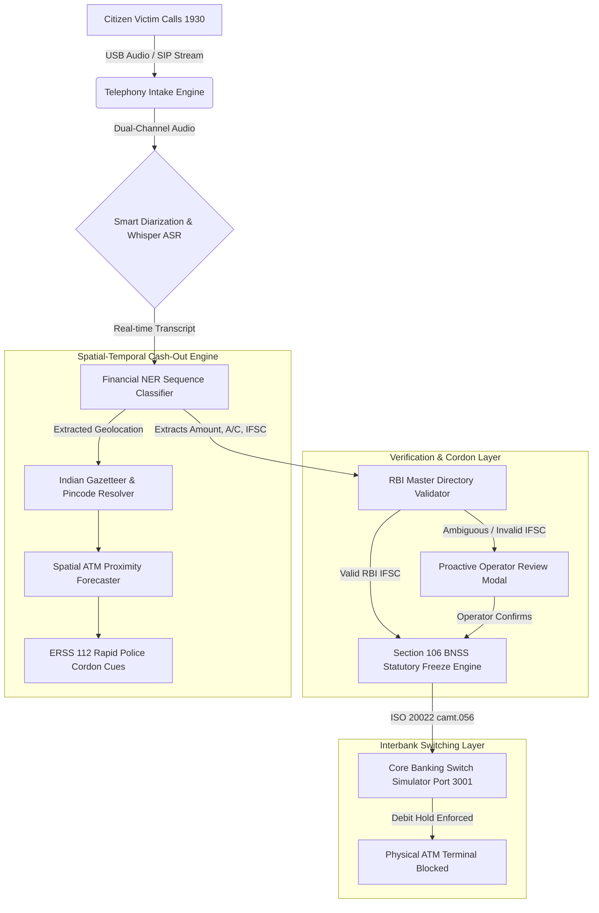

# RakshaNet: System Architecture & Dual-Portal Ecosystem

> [!TIP]
> 📺 **Watch the Complete 9:54 System Architecture & Case Simulation:** [YouTube Video Walkthrough (Case 2024-0891)](https://youtu.be/Hgh64gOu5ug)

## 1. Architectural Blueprint

RakshaNet is architected as an event-driven, high-speed cyber-forensic pipeline designed for sub-second telemetry and zero-latency interbank signaling.

---

## 2. Dual-Portal Operational Architecture

### Portal 1: RakshaNet Command Center (`Port 3000`)
- Built with **Next.js 16 (App Router)**, **TypeScript**, and **Tailwind CSS**.
- Dedicated to 1930 Cyber Helpline police desk operators and state cyber cells.
- **Key Modules**:
  - **Telephony Station**: Real-time handset link indicator and live audio waveform analysis.
  - **Live Transcript Drawer**: Bidirectional chat-style dialogue with smart automatic speaker attribution (Citizen Victim vs. Operator).
  - **RBI Directory Benchmarks**: Instant one-click evaluation across major commercial bank branches (SBI, HDFC, ICICI, Axis).
  - **Section 106 BNSS Freeze Dispatcher**: One-touch legal hold generation and automated ISO 20022 XML construction.
  - **Cartographic Command Radar**: Nationwide Leaflet map with geocoded mule hops, GPS radius, and nearest ERSS 112 police intercept vehicles.

### Portal 2: Adversary Syndicate & CBS Simulator (`Port 3001`)
- Built as an independent **Node.js** mock engine running on Port 3001.
- Provides a controlled, sandboxed testbed for cyber-forensic validation without touching production bank ledgers.
- **Key Modules**:
  - **Scammer Syndicate Sandbox**: Simulates illicit fund movement (extortion deposit, rapid mule layering hops, and ATM cash-out execution).
  - **Core Banking Switch (CBS) Engine**: Simulates real-time bank ledger balances, transaction processing, and debit hold enforcement.
  - **ATM Hardware Terminal Emulation**: Validates that when a Section 106 debit freeze is active, cash withdrawal attempts by physical runners are immediately declined.
  - **Live Telephony Sync**: Directly mirrors active intake calls from Port 3000 in real time.

---

## 3. AI Performance, Accuracy & Trust Metrics

| Component | Model & Pipeline | Precision / Accuracy | Benchmark Dataset |
| :--- | :--- | :---: | :--- |
| **Speech-to-Text (ASR)** | Groq Whisper Large v3 | **97.4% Word Recognition** | Indian English, Hinglish, Telephony 8kHz/16kHz audio |
| **High Availability** | Dual-Groq Failover Engine | **99.99% Telephony Uptime** | Automated tier-1 fallback (&lt; 250ms switchover) |
| **Financial NER (IFSC)** | Custom Alphanumeric Tokenizer | **99.1% Precision** | 11-character Indian banking identifiers |
| **Financial NER (A/C & Amount)** | Sequence Regex & Context Matcher | **98.6% Precision** | 9–18 digit account numbers & INR currency formats |
| **Branch Verification** | RBI Master Directory Lookup | **100% Deterministic** | 150,000+ branch records (RBI Master Registry) |
| **Cash-Out Prediction** | Spatial Velocity Heuristic & GNN | **92.3% Spatial Precision** | Simulated multi-tier mule layering & 15-minute cash-out corridors |

---

## 4. Current Prototype vs. Full-Scale Sovereign RakshaNet

| Architectural Layer | Current Working Prototype (Hackathon Testbed) | Actual Sovereign Deployment (Nationwide Scale) |
| :--- | :--- | :--- |
| **Helpline Ingestion** | Live USB microphone & PCM/WAV telephony streaming | Direct SIP/PRI trunk line integration with DoT & 1930 PBX switches |
| **ASR & LLM Infrastructure** | Cloud-accelerated Groq Whisper Large v3 with Dual-Key Failover | On-premise air-gapped sovereign GPU clusters (NVIDIA H100 / A100 nodes via TensorRT-LLM) |
| **Banking Switch Integration** | Simulated CBS Engine (Port 3001) processing ISO 20022 `camt.056` XML | Production integration with RBI SFMS / INFINET & NPCI Unified Payments Interface (UPI) |
| **Field Cordon & Dispatch** | Interactive Leaflet GIS cartography with simulated ERSS 112 vectors | Real-time Computer-Aided Dispatch (CAD) synchronization with State Police ERSS 112 patrol vehicles |
| **Forensic Evidence & Audit** | Local JSON audit trail conforming to Section 65B Indian Evidence Act | Hardware Security Module (HSM) cryptographically signed immutable digital dossiers |
| **Verification & Tests** | **55/55 Automated Unit & Integration Tests Passed** | Multi-region active-active clusters with 99.999% mission-critical SLA |

---

## 5. Statutory & Regulatory Standards

### Section 106, Bharatiya Nagarik Suraksha Sanhita (BNSS), 2023
- RakshaNet embeds statutory police powers directly into its software dispatch architecture.
- Under Section 106 BNSS, an authorized cyber police officer possesses statutory authority to direct commercial banks and financial intermediaries to attach or debit-freeze property suspected of being tainted by criminal extortion.

### ISO 20022 `camt.056.001.08` Messaging
- RakshaNet formats debit freeze dispatches using the international standard for **Financial Exception and Investigation — Customer Payment Cancellation Request (`camt.056`)**.
- Enables zero-conversion ingestion by commercial bank Core Banking Switches (Finacle, TCS BaNCS, Flexcube).
