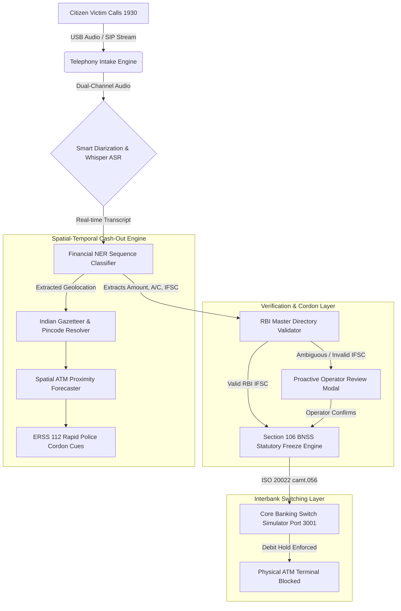

# RakshaNet: System Architecture & Dual-Portal Ecosystem

## 1. Architectural Blueprint

RakshaNet is architected as an event-driven, high-speed cyber-forensic pipeline designed for sub-second telemetry and zero-latency interbank signaling.

---

## 2. Dual-Portal Operational Architecture

### Portal 1: RakshaNet Command Center (`Port 3000`)
- Built with **Next.js 16 (App Router)**, **TypeScript**, and **Tailwind CSS**.
- Dedicated to 1930 Cyber Helpline police desk operators and state cyber cells.
- **Key Modules**:
  - **Telephony Station**: Real-time handset link indicator and live audio waveform analysis.
  - **Live Transcript Drawer**: Bidirectional chat-style dialogue with smart automatic speaker attribution (Citizen Victim vs. Operator).
  - **RBI Directory Benchmarks**: Instant one-click evaluation across major commercial bank branches (SBI, HDFC, ICICI, Axis).
  - **Section 106 BNSS Freeze Dispatcher**: One-touch legal hold generation and automated ISO 20022 XML construction.
  - **Cartographic Command Radar**: Nationwide Leaflet map with geocoded mule hops, GPS radius, and nearest ERSS 112 police intercept vehicles.

### Portal 2: Adversary Syndicate & CBS Simulator (`Port 3001`)
- Built as an independent **Node.js** mock engine running on Port 3001.
- Provides a controlled, sandboxed testbed for cyber-forensic validation without touching production bank ledgers.
- **Key Modules**:
  - **Scammer Syndicate Sandbox**: Simulates illicit fund movement (extortion deposit, rapid mule layering hops, and ATM cash-out execution).
  - **Core Banking Switch (CBS) Engine**: Simulates real-time bank ledger balances, transaction processing, and debit hold enforcement.
  - **ATM Hardware Terminal Emulation**: Validates that when a Section 106 debit freeze is active, cash withdrawal attempts by physical runners are immediately declined.
  - **Live Telephony Sync**: Directly mirrors active intake calls from Port 3000 in real time.

---

## 3. Statutory & Regulatory Standards

### Section 106, Bharatiya Nagarik Suraksha Sanhita (BNSS), 2023
- RakshaNet embeds statutory police powers directly into its software dispatch architecture.
- Under Section 106 BNSS, an authorized cyber police officer possesses statutory authority to direct commercial banks and financial intermediaries to attach or debit-freeze property suspected of being tainted by criminal extortion.

### ISO 20022 `camt.056.001.08` Messaging
- RakshaNet formats debit freeze dispatches using the international standard for **Financial Exception and Investigation — Customer Payment Cancellation Request (`camt.056`)**.
- Enables zero-conversion ingestion by commercial bank Core Banking Switches (Finacle, TCS BaNCS, Flexcube).
